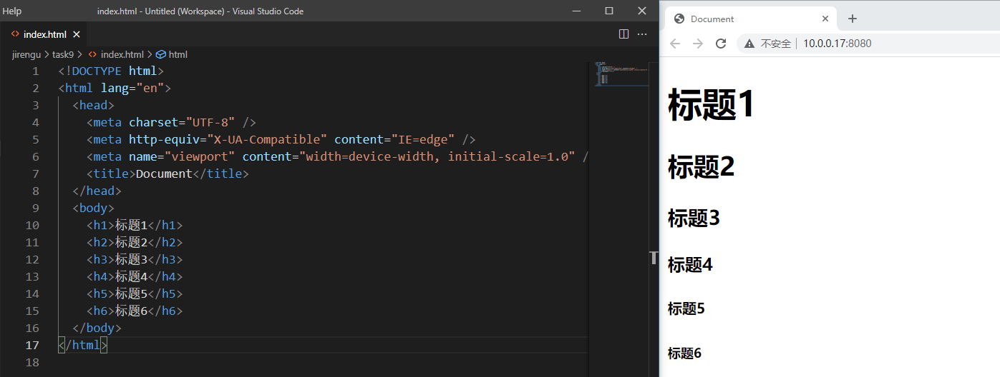
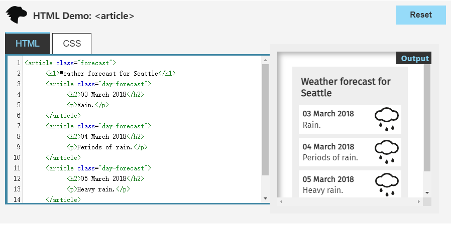

# HTML入门笔记1

## 1.HTML是谁发明的

HTML是由英国计算机科学家蒂姆.伯纳斯.李（Tim Berners-Lee）发明。


* 1990年底，蒂姆.伯纳斯.李规定了HTML，并写出浏览器和服务器软件；
* 1991年底，HTML的首个公开描述出现于一个名为HTML Tags的文件中，由蒂姆·伯纳斯-李提及。


## 2.HTML 起手应该写什么

HTML起手应该包含：

1.声明文件类型：`<!DOCTYPE html>`，告知浏览器，以html文件识别该文件；

2.根元素`<html></html>`，并且声明该html所使用的语言：`<html lang="en"></html>`，如果是中文网页，应该将“en”改为“zh-CN”，即`<html lang="zh-CN">`，注意，这里"CN"为大写字母，一个网页只能有一个根元素标签；

3.head标签：`<head></head>`，用于放置网页的元信息，即一些描述该网页基本属性、特质的内容，这些内容不会出现在网页上，而是为了网页渲染提供额外的信息；

​	head标签内部的子元素：

​	3.1.`<meta charset="UTF-8">`，声明该页面的内容采用“UTF-8”的编码方式编码，即以什么规则将计算机认识的“文字”转换为人类认识的“文字”，UTF-8是目前最广泛使用的编码方式，可以支持中英文等，如果设置不正确的编码方式，网页可能会显示为乱码，需要注意，声明使用“UTF-8”，就需要使用“UTF-8”编码保存HTML文件，否则也可能显示为乱码；

​	3.2.`<meta http-equiv="X-UA-Compatible" content="IE=edge">`，声明该页面回应的头信息字段，要求浏览器为IE最新版；

​	3.3.`<meta name="viewport" content="width=device-width, initial-scale=1.0">`，声明该页面如何布局，布局具体的设定值为width=device-width, initial-scale=1.0，分别标明该页面宽度以设备宽度作为页面宽度，比如，可以在手机端很好的缩放显示页面，以及初始的页面缩放值为1；

​	3.4.`<title>Document</title>`，定义该html文件在浏览器标题栏显示的内容；

4.body标签：`<body></body>`，用于放置网页的主题内容，浏览器显示该html文件的内容都是放置在body标签内部的内容。


通过IDE，VSCode，新建一个html文件，输入感叹号“！”然后回车，可以快速生成“起手”需要的内容，参见下图：


## 3.常用的表章节的标签有哪些，分别是什么意思

* `<h1>`~`<h6>`

  标题（Headline），`<h1>`~`<h6>`分别代表1~6个不同级别的标题，1号标题最大，6号标题最小

  

  

* `<section>`

  章节（Section），表示一个含有特定主题的独立部分，通常在文档里面表示一个章节，一般来说会包含一个标题。

  一般来说，`<section>`总是多个一起使用，放在`<article>`标签内。

  

  

* `<article>`

  通常用来表示文档、页面、应用或网站中的独立结构，即使页面的其他部分不存在，也具有独立的意义。

  如在发布中，它可能是论坛帖子、杂志或新闻文章、博客、用户提交的评论、交互式组件，或者其他独立的内容项目。

  `<article>`可以有自己的标题（`<h1>`~`<h6>`）。

  比如，下面就是一个天气组件。

  

  一个网页可以包含一个或多个`<article>`标签，比如一个网页包含多篇文章。

  

* `<p>`

  段落（paragraph）标签，想以一个段落显示的内容，可以放进p标签内。

  不仅是文本，任何想以段落现实的内容，比如图片和表单项，都可以放进p元素。

  该元素通常表现为一整块与相邻文本分离的文本，或以垂直的空白间隔或以首行缩进。

  

  

* `<header>`

  用于展示介绍性内容，通常包含一组介绍性或是辅助导航的实用元素。

  可能包含一些标题元素，也可能包含Log，搜索框，作者名称等等。

  `<header>`标签可以表示整个网页的头部，也可以表示一篇文章或者一个区块的头部。

  如果用在网页的头部，称为“页眉”。网站导航和搜索栏通常放在`<header>`里面

  

  

* `<footer>`

  HTML `<footer>` 元素表示最近一个章节内容或者根节点（sectioning root ）元素的页脚。一个页脚通常包含该章节作者、版权数据或者与文档相关的链接等信息。

  

  `<footer>`不能嵌套，即内部不能放置另一个`<footer>`，也不能放置`<header>`。

  

* `<main>`

  `<main>`表示页面的主体内容，一个页面只能有一个`<main>`。

  `<main>`是顶层标签，不能放置在`<header>`、`<footer>`、`<article>`、`<aside>`、`<nav>`等标签中。

  

  

* `<aside>`

  用来放置与网页或文章主要内容间接相关的部分。

  比如：网页的侧边栏，文章的评论或注释

  

  

* `<div>`

  表示一个区块（division），如果一个网页需要一个块级元素容器，又没有其他合适的标签，就可以使用`<div>`。

  最常见的用途是提供CSS的钩子，用来指定各种样式。

  

  只要样式上需要多个块级元素组合在一起，就可以使用`<div>`，但是，这应该是最后的措施。

  带有语义的块级标签（`<article>`、`<section>`、`<aside>`、`<nav>`等）始终应该优先使用。


## 4.全局属性有哪些

* class

  class属性用于对网页的元素进行分类。如果不同元素的class值相同，则表示它们是一类。

  ```html
  <p class="para"></p>
  <p></p>
  <p class="para"></p>
  ```

  上面代码第1个`<p>`里面的内容和第3个`<p>`里面的内容是一类，因为他们的class都是“para”.

  元素可以同时具有多个 class，它们之间使用空格分隔。

  ```html
  <p class="p1 p2 p3"></p>
  ```

  

* contenteditable

  contenteditable属性允许用户修改内容。

  


* hidden

  hidden表示当前的网页元素不再跟页面相关，浏览器不会渲染这个元素，所以就不会在网页中看到它。

  

  CSS的可见性高于hidden属性，如果CSS设为该元素可见，hidden属性将无效。

  

* id

  `id`属性是元素在网页内的唯一标识符。`id`属性必须全局唯一，同一个页面不能有两个相同的`id`属性。

  `id`属性的值不能包含空格。

  `id`属性的值还可以在最前面加上`#`，放到 URL 中作为锚点，定位到该元素在网页内部的位置。

  注意，`id`要求全局唯一，但是不唯一并不会报错，所以，能不用则不用。

  ```html
  <p id="p1"></p>
  <p id="p2"></p>
  <p id="p3"></p>
  ```

  上面的代码，同样是段落`p`，但是`id`不同，就是不同的段落。

  

* style

  `style`属性用来指定当前元素的 CSS 样式。

  

  设定文字的颜色为红色。


* tabindex

  tab键的跳转序列号。通过按键盘Tab键对网页中的元素选择。

  * -1为不参与遍历；
  * 0为最后一个遍历；
  * 正整数，网页元素按照从小到大的顺序遍历。

  一般来说，`tabindex`属性最好都设成`0`，按照自然顺序进行遍历，这样比较符合用户的预期，除非网页有特殊布局。

  

* title

  `title`属性用来为元素添加附加说明。大多数浏览器中，鼠标悬浮在元素上面时，会将`title`属性值作为浮动提示，显示出来。

  


## 5.常用的内容标签有哪些，分别是什么意思

* `<ol>` + `<li>`

  有序列表+列表项

  

  列表项前自动加数字序号。

  

* `<ul>` + `<li>`

  无序列表+列表项

  列表项前面生成实心小圆点，作为列表符号。

  

  

* `<dl>` + `<dt>` + `<dd>`

  `<dl>` （description list），描述列表，表明该元素内，是要描述一个东西；

   `<dt>`（description term），描述项，表明要描述的对象；

   `<dd>`（description detail），描述详情，表明对该元素外层描述对象元素的具体描述。

  


* `<pre>`

  preformatted，浏览器会保留该标签内部代码的换行和空格，默认以等宽字体显示标签内容。

  


* `<hr>`

  水平分割线

  

  该标签是历史遗留下来的，建议尽量避免使用。主题之间的分隔可以使用`<section>`，如果想要水平线的效果，可以使用 CSS。

  

* `<br>`

  换行

  

  注意，块级元素的间隔，不要使用`<br>`来产生，而要使用 CSS 指定。

  ```html
  <p>第一段</p>
  <br>
  <br>
  <p>第二段</p>
  ```

  上面的代码希望段落之间有两个换行，这时不应该使用`<br>`，而应该使用 CSS。

  

* `<a>`

  链接标签

  ```html
  <a href="https://wikipedia.org/">维基百科</a>
  ```

  <a>标签内部不仅可以放置文字，也可以放置其他元素，比如段落、图像、多媒体等等。

  ```html
  <a href="https://www.example.com/">
    
  </a>
  ```

  比如，通过点击图片，跳转到指定的链接。

  `<a>`标签有几个重要的属性：

  1. href

     给出链接指向的网址，值应该是一个URL或者锚点。

     ```html
     <a href="#xxx">示例</a>
     ```

     点击“示例”，会跳转到元素id为xxx的元素所在位置。

     

  2. target

     指定以何方式打开链接，可以在指定的窗口打开，可以在iframe里面打开，可以打开新的窗口，可以在本窗口打开。

     * `_self`：当前窗口打开，默认值。
     * `_blank`：新窗口打开
     * `_parent`：上层窗口，父窗口打开，如果当前窗口么有上层窗口，等同于`_self`
     * `_top`：顶层窗口打开，如果当前窗口就是顶层窗口，等同于`_self`

     使用`target`属性的时候，最好跟`rel="noreferrer"`一起使用，这样可以避免安全风险。

     `noreferrer`：告诉浏览器打开链接时，不要将当前网址作为 HTTP 头信息的`Referer`字段发送出去，这样可以隐藏点击的来源。

  

  3. download

     `download`属性表明当前链接用于下载，而不是跳转到另一个 URL。

     ```html
     <a href="demo.txt" download>下载</a>
     ```

     注意，`download`属性只在链接与网址同源时，才会生效。也就是说，链接应该与网址属于同一个网站。


* `<em>`

  emphasize，表示强调，通常，浏览器会议斜体显示该标签包含的内容。

  ```html
  <p>我是需要<em>强调</em>的内容。</p>
  ```

  

  

* `<strong>`

  strong，表示内容很重要，通常，浏览器会以加粗显示。

  

  

* `<code>`

  `<code>`标签里的内容是计算机代码，浏览器默认会以等宽字体显示。

  ```html
  <code>alert()</code>
  ```

  如果要表示多行代码，`<code>`标签必须放在`<pre>`内部。`<code>`本身仅表示一行代码。

  ```html
  <pre>
  <code>
    let a = 1;
    console.log(a);
  </code>
  </pre>
  ```

  

* `<blockquote>`

  表示引用他人的话。

  

  `<blockquote>`标签有一个`cite`属性，它的值是一个网址，表示引言来源，不会显示在网页上。

  

* `<q>`

  `<q>`也表示引用，与`<blockquote>`的区别，就是它不会产生换行。

  


## 参考

[HTML]https://zh.wikipedia.org/wiki/HTML

[HTML 元素参考]https://developer.mozilla.org/zh-CN/docs/Web/HTML/Element

[HTML 属性参考]https://developer.mozilla.org/zh-CN/docs/Web/HTML/Attributes

[网页的语义结构]https://wangdoc.com/html/semantic.html

[网页元素的属性]https://wangdoc.com/html/attribute.html