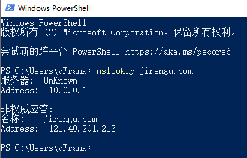
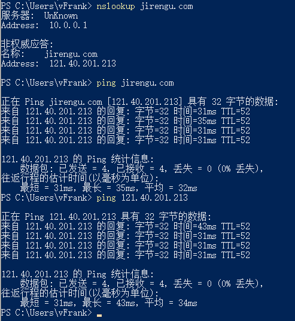

# 浅析URL

## 1.URL 包含哪几部分，每部分分别有什么作用

一个比较复杂的URL如下：

```
https://www.example.com:80/path/to/myfile.html?key1=value1&key2=value2#anchor
```

它的组成部分包括：

1. 协议

   上面的例子是`https`，常见的还有`http`。

2. 主机

   主机（host）是资源所在的网站名或服务器的名字，又称为域名。上例的主机是`www.example.com`。

3. 端口

   同一个域名下面可能同时包含多个网站，它们之间通过端口（port）区分。

   默认使用`80`端口，端口跟在域名后面用`：`分开。

4. 路径

   路径（path）是资源在网站的位置。

   `/path/to/myfile.html`指的就是路径path下面的to下面的`myfile.html`文件。

5. 查询参数

   查询参数的格式为`关键字=值`，多个关键字用&符号链接。

   上面的例子查询两个关键字，分别为value1和value2。

6. 锚点

   #号后面是锚点，可以跳转到html中对应的元素位置。

   比如上面的例子，页面加载后，会自动滚动到anchor的位置。


## 2.DNS 的作用是什么，nslookup 命令怎么用

DNS用于解析域名和IP地址，通常我们访问网站是通过域名，因为IP地址不好记。

输入域名后，DNS就会将域名解析成IP地址，最终，我们实际上还是通过了IP访问了目标。


打开命令行，输入nslookup + 域名，就可以在你设定的DNS服务器上查询到该域名对应的IP地址。



比如，我在我电脑上查询到的jirengu.com这个域名对应的IP地址为121.40.201.213。


所以，这里其实要注意，如果我指定了一个恶意的DNS服务器用于解析，就可能将域名解析到一个假的IP地址，而这个IP地址的页面可能跟真的是一样的，就可能骗取我的信息。


## 3.IP 的作用是什么，ping 命令怎么用

IP是网络中的通信地址，通过IP地址，网络设备就能将数据包转发到指定的服务器，以实现通信。


ping+IP地址或域名，就可以测试本地到目标IP地址的连通性，当然，有些服务器设置了禁止ping。


下面是ping饥人谷的例子，通过域名和IP都可以ping




## 4.域名是什么，分别哪几类域名

域名（英语：Domain Name），又称网域，是由一串用点分隔的名字组成的Internet上某一台计算机或计算机组的名称。

域名分为顶级域名和其他级别域名。

常见的.com, .net, .cn, .io就是顶级域名


由右侧往左依次就是二级域名、三级域名。。。。

比如jirengu.com，.com就是一级域名，jirengu.com就是二级域名。

